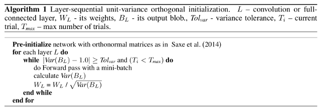

# torch_lsuv_init

PyTorch implementation of layer sequential unit variance (LSUV), as described in ["All you need is a good init" by Mishkin, D. et al (2015)](https://arxiv.org/abs/1511.06422):



## Why?

We were unable to find a short, simple implementation online.

Excluding comments, this one is under 30 lines of code.

It's meant to be easy to understand/modify.

## Installation

Copy the file `torch_lsuv_init.py` to your application directory.

## Requirements

The only requirement is a working installation of [PyTorch](https://pytorch.org/) on Python 3.

Note: Tested only with PyTorch versions 1.0 and 1.1, on Ubuntu Linux 18.04 and Python 3.6+.

## Sample usage

```python
from torch_lsuv_init import LSUV_

LSUV_(model, data)
```

Where: `model` is the model to be initialized and `data` is a sample batch of input data drawn from the training dataset. Several optional arguments are not shown here. Please see the code for details.

## Notes

This implementation uses PyTorch's built-in orthogonal init, which at the time of writing (mid-2019) relies on QR decomposition, instead of singular value decomposition (SVD) as in other implementations.

## Licence

torch_lsuv_init is released by GlassRoom Software LLC under the [MIT License](LICENSE).
